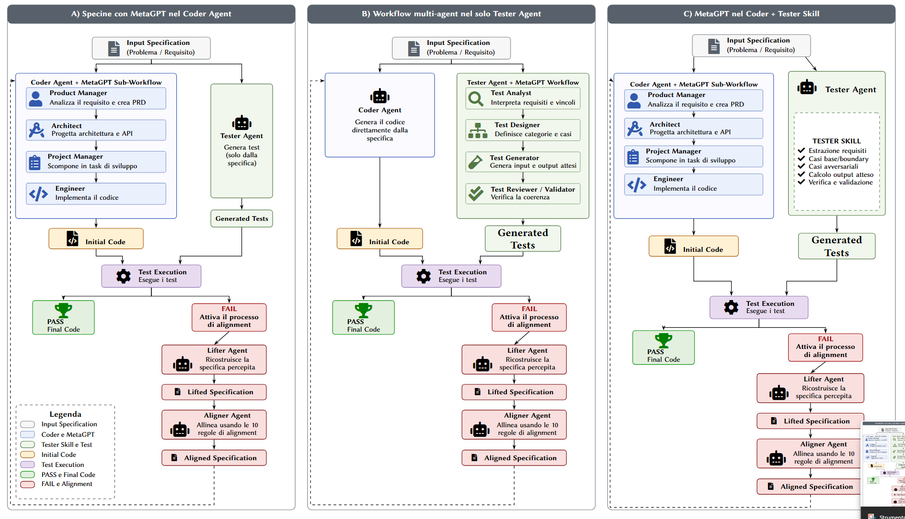
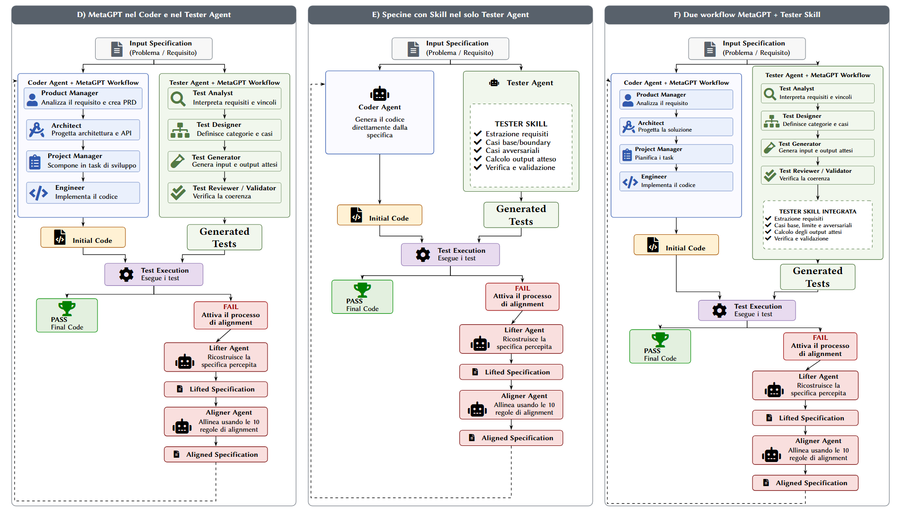

# Specine: MetaGPT Variants and Tester Skill / Varianti MetaGPT e Tester Skill

## Paper Repository / Repository del paper

> [!IMPORTANT]
> **[Delegated Code Generation with LLM Agents: Paper Repository / Repository del paper](https://github.com/FlorindoDev/Delegated-Code-Generation-with-LLM-Agents)**

## Contents / Indice

- [English](#english)
  - [Objective](#objective)
  - [Execution modes](#execution-modes)
  - [Environment setup](#environment-setup)
  - [Available benchmarks](#available-benchmarks)
  - [Downloading the datasets](#downloading-the-datasets)
  - [Default model](#default-model)
  - [Compatible APIs](#compatible-apis)
  - [Runnable files and flags](#runnable-files-and-flags)
  - [Complete default run configuration](#complete-default-run-configuration)
  - [Starting the baseline (Base)](#starting-the-baseline-base)
  - [Starting variant A](#starting-variant-a)
  - [Starting variants B–F](#starting-variants-bf)
  - [Quick run](#quick-run)
  - [Initial Code cache and parallelism](#initial-code-cache-and-parallelism)
  - [Results](#results)
- [Italiano](#italiano)
  - [Obiettivo](#obiettivo)
  - [Modalità di esecuzione](#modalità-di-esecuzione)
  - [Preparazione dell'ambiente](#preparazione-dellambiente)
  - [Benchmark disponibili](#benchmark-disponibili)
  - [Download dei dataset](#download-dei-dataset)
  - [Modello predefinito](#modello-predefinito)
  - [API compatibili](#api-compatibili)
  - [File avviabili e flag](#file-avviabili-e-flag)
  - [Configurazione completa del run predefinito](#configurazione-completa-del-run-predefinito)
  - [Avvio della baseline (Base)](#avvio-della-baseline-base)
  - [Avvio della variante A](#avvio-della-variante-a)
  - [Avvio delle varianti B–F](#avvio-delle-varianti-bf)
  - [Esecuzione rapida](#esecuzione-rapida)
  - [Cache dell'Initial Code e parallelismo](#cache-dellinitial-code-e-parallelismo)
  - [Risultati](#risultati)





## English

## Objective

This fork compares the original Specine generation process with variants that evolve the Coder Agent and Tester Agent workflows.

The [Base mode](#starting-the-baseline-base) uses direct agents. Variants A–F combine three reusable components in a controlled manner: the Coder MetaGPT workflow, the Tester MetaGPT workflow, and the Tester Skill.

The only available benchmarks are APPS, APPS-Eval, and CodeContests-Raw.

> [!NOTE]
> Among the variants described below, the paper experimentally tests only variants A, B, and D. Variants C, E, and F have been implemented but were not tested in the paper.

## Execution modes

The **Base (baseline)** is the reference version: it runs the original Specine workflow, in which the Coder Agent generates code with a single model call. Start it with `--variant base`; because `base` is the default value, the flag may be omitted. See [Starting the baseline](#starting-the-baseline-base).

**Variant A** keeps the Tester Agent and the Specine alignment process unchanged, but replaces direct Coder Agent generation with a MetaGPT sub-workflow: Product Manager, Architect, Project Manager, and Engineer work in sequence before code generation. See [Starting variant A](#starting-variant-a).

**Variant B** keeps the direct Coder Agent and uses the MetaGPT workflow in the Tester Agent. Test Analyst, Test Designer, Test Generator, and Test Reviewer / Validator interpret constraints, design cases, calculate expected outputs, and validate the final JSON.

**Variant C** combines the MetaGPT Coder from variant A with a direct Tester Agent guided by the Tester Skill. The Skill enforces requirement extraction, base/boundary and adversarial cases, independent output calculation, and validation.

**Variant D** uses both MetaGPT workflows. The four Coder roles produce the Initial Code; the four Tester roles produce and review the Generated Tests.

**Variant E** keeps the direct Coder Agent and applies only the Tester Skill. Comparing it with Base therefore isolates the Skill's effect on test quality.

**Variant F** integrates both MetaGPT workflows and injects the Tester Skill into every phase of the Tester workflow. It is the most complete configuration and the most expensive in terms of LLM calls.

The default Skill lives in `tester_skill.py`: edit `DEFAULT_TESTER_SKILL` or pass another `TesterSkill` instance to `create_tester_workflow` to experiment with different instructions without changing the workflow.

Base results serve as the comparison point for measuring the effect of the other modes. For a fair comparison, use the same model, the same benchmark, and the same maximum number of iterations; only the selected workflow should change.

## Environment setup

Run every command from the project's root directory. Python 3.10 is required.

### Windows PowerShell

```powershell
py -3.10 -m venv .venv
.\.venv\Scripts\Activate.ps1
python -m pip install --upgrade pip
python -m pip install -r requirements.txt
```

If PowerShell does not allow activation of the virtual environment, use its interpreter directly.

```powershell
.\.venv\Scripts\python.exe -m pip install --upgrade pip
.\.venv\Scripts\python.exe -m pip install -r requirements.txt
```

### Linux and macOS

```bash
python3.10 -m venv .venv
source .venv/bin/activate
python -m pip install --upgrade pip
python -m pip install -r requirements.txt
```

The dependencies install PyTorch 2.5.1 for CUDA 12.4. An NVIDIA GPU is recommended to run a 7-billion-parameter model locally.

## Available benchmarks

1. APPS uses the `apps` identifier.

2. APPS-Eval uses the `apps-eval` identifier.

3. CodeContests-Raw uses the `codecontests-raw` identifier.

APPS and APPS-Eval share the `Datasets/apps.jsonl` file. Therefore, it is sufficient to download it once. CodeContests-Raw uses `Datasets/code_contests.jsonl`.

## Downloading the datasets

The downloader displays a menu containing only the three supported choices. Enter the number of the desired dataset.

```powershell
python download_datasets.py
```

To download APPS directly, use this command.

```powershell
python download_datasets.py --benchmark apps
```

To download APPS-Eval directly, use this command. If APPS has already been downloaded, the program recognizes that the shared file is present and does not download it again.

```powershell
python download_datasets.py --benchmark apps-eval
```

To download CodeContests-Raw directly, use this command.

```powershell
python download_datasets.py --benchmark codecontests-raw
```

Zenodo distributes the datasets in a single archive. The program downloads the official archive, verifies its size and MD5, extracts only the requested file, and verifies it using its size and CRC32. When it finishes, it keeps only the selected file in the `Datasets` directory and removes the temporary archive.

An existing valid dataset is not overwritten. To intentionally replace an existing file, add `--force`.

```powershell
python download_datasets.py --benchmark apps --force
```

## Default model

The default model is `deepseek-coder-7b-instruct-v1.5`. All commands shown below use DeepSeek without requiring the `--model_name` option.

After installing the dependencies and activating the virtual environment, download the model with the script included in the project:

```bash
python download_model.py
```

The script downloads the entire `deepseek-ai/deepseek-coder-7b-instruct-v1.5` repository to the location expected by the program:

```text
LLMs/deepseek-coder-7b-instruct-v1.5/
```

The directory must contain the model configuration, tokenizer, and weights. An interrupted download can be resumed by running the same command again; files that are already up to date are not downloaded again.

Qwen2.5-Coder-7B-Instruct can be run locally under the name `Qwen2.5-Coder-7B-Instruct` or through OpenRouter. To use it through the API, configure `OPENROUTER_API_KEY` and set the Qwen slug in `OPENROUTER_MODEL`.

```powershell
$env:OPENROUTER_API_KEY="<api-key>"
$env:OPENROUTER_MODEL="qwen/qwen2.5-coder-7b-instruct"
python alignment.py --model_name openrouter --benchmark apps --save_dir qwen_openrouter_apps
```

## Compatible APIs

The project uses the OpenAI Python client and supports these providers:

| Provider | `--model_name` value | Required variables | Default endpoint |
| --- | --- | --- | --- |
| OpenAI | `gpt-4o-mini-2024-07-18` | `OPENAI_API_KEY` | Official OpenAI client endpoint |
| Google Gemini | `gemini-1.5-flash-002` | `GEMINI_API_KEY` | `https://generativelanguage.googleapis.com/v1beta/openai/` |
| OpenRouter | `openrouter` | `OPENROUTER_API_KEY`, `OPENROUTER_MODEL` | `https://openrouter.ai/api/v1` |

The variables can be defined in the system or in a `.env` file in the root directory. Copy `.env.example` to `.env` and fill in only the provider being used.

With OpenRouter, `OPENROUTER_MODEL` accepts any textual slug available in the [OpenRouter catalog](https://openrouter.ai/models) that is compatible with Chat Completions. Example:

```env
OPENROUTER_API_KEY=sk-or-v1-...
OPENROUTER_MODEL=qwen/qwen2.5-coder-7b-instruct
OPENROUTER_APP_TITLE=Specine
```

```powershell
python alignment.py --model_name openrouter --benchmark apps --save_dir openrouter_apps
```

`OPENROUTER_HTTP_REFERER` and `OPENROUTER_APP_TITLE` are optional. `OPENROUTER_BASE_URL`, `GEMINI_BASE_URL`, and `OPENAI_BASE_URL` allow the default endpoints to be replaced. OpenRouter is compatible with the OpenAI client used by the project and returns `prompt_tokens` and `completion_tokens`, so token counting remains active. See the [OpenRouter documentation for the OpenAI SDK](https://openrouter.ai/docs/guides/community/openai-sdk).

## Runnable files and flags

The supported CLIs are `alignment.py` for running benchmarks, `download_datasets.py` for downloading datasets, and `eval_code.py` for aggregating Pass@1 and AvgPassRatio from each iteration's results. `eval_code.py` also preserves the previous legacy evaluation entry point.

### alignment.py

<table>
  <thead>
    <tr>
      <th>File</th>
      <th>Flag</th>
      <th>Required</th>
      <th>Default</th>
      <th>Allowed values</th>
      <th>Function</th>
    </tr>
  </thead>
  <tbody>
    <tr>
      <td><code>alignment.py</code></td>
      <td><code>-h</code>, <code>--help</code></td>
      <td>No</td>
      <td>None</td>
      <td>None</td>
      <td>Displays the CLI help and exits.</td>
    </tr>
    <tr>
      <td><code>alignment.py</code></td>
      <td><code>--benchmark</code></td>
      <td>Yes</td>
      <td>None</td>
      <td><code>apps</code>, <code>apps-eval</code>, <code>codecontests-raw</code></td>
      <td>Selects the benchmark to run.</td>
    </tr>
    <tr>
      <td><code>alignment.py</code></td>
      <td><code>--model_name</code></td>
      <td>No</td>
      <td><code>deepseek-coder-7b-instruct-v1.5</code></td>
      <td><code>deepseek-coder-7b-instruct-v1.5</code>, <code>Qwen2.5-Coder-7B-Instruct</code> (local), <code>gpt-4o-mini-2024-07-18</code>, <code>gemini-1.5-flash-002</code>, <code>openrouter</code></td>
      <td>Selects the local model or API backend.</td>
    </tr>
    <tr>
      <td><code>alignment.py</code></td>
      <td><code>--variant</code></td>
      <td>No</td>
      <td><code>base</code></td>
      <td><code>base</code>, <code>A</code>, <code>B</code>, <code>C</code>, <code>D</code>, <code>E</code>, <code>F</code></td>
      <td><code>A</code>: Coder MetaGPT; <code>B</code>: Tester MetaGPT; <code>C</code>: Coder MetaGPT + Tester Skill; <code>D</code>: both MetaGPT; <code>E</code>: Tester Skill; <code>F</code>: both MetaGPT + Tester Skill.</td>
    </tr>
    <tr>
      <td><code>alignment.py</code></td>
      <td><code>--save_dir</code></td>
      <td>Yes</td>
      <td>None</td>
      <td>Directory name</td>
      <td>Sets the name of the directory in which results are saved.</td>
    </tr>
    <tr>
      <td><code>alignment.py</code></td>
      <td><code>--max_iter</code></td>
      <td>No</td>
      <td><code>10</code></td>
      <td>Positive integer</td>
      <td>Sets the maximum number of iterations for each problem.</td>
    </tr>
    <tr>
      <td><code>alignment.py</code></td>
      <td><code>--debug</code></td>
      <td>No</td>
      <td>Disabled</td>
      <td>Flag without a value</td>
      <td>Prints model prompts and responses during execution.</td>
    </tr>
  </tbody>
</table>

### download_datasets.py

<table>
  <thead>
    <tr>
      <th>File</th>
      <th>Flag</th>
      <th>Required</th>
      <th>Default</th>
      <th>Allowed values</th>
      <th>Function</th>
    </tr>
  </thead>
  <tbody>
    <tr>
      <td><code>download_datasets.py</code></td>
      <td><code>-h</code>, <code>--help</code></td>
      <td>No</td>
      <td>None</td>
      <td>None</td>
      <td>Displays the CLI help and exits.</td>
    </tr>
    <tr>
      <td><code>download_datasets.py</code></td>
      <td><code>--benchmark</code></td>
      <td>No</td>
      <td>Interactive menu</td>
      <td><code>apps</code>, <code>apps-eval</code>, <code>codecontests-raw</code></td>
      <td>Downloads the dataset associated with the benchmark. If omitted, displays the selection menu.</td>
    </tr>
    <tr>
      <td><code>download_datasets.py</code></td>
      <td><code>--force</code></td>
      <td>No</td>
      <td>Disabled</td>
      <td>Flag without a value</td>
      <td>Downloads and replaces the dataset again even when the file already exists.</td>
    </tr>
  </tbody>
</table>

### eval_code.py

Metrics mode reads results already produced by Specine and does not rerun code or LLM calls. Options marked as legacy remain available for compatibility.

<table>
  <thead>
    <tr>
      <th>File</th>
      <th>Flag</th>
      <th>Required</th>
      <th>Default</th>
      <th>Allowed values</th>
      <th>Function</th>
    </tr>
  </thead>
  <tbody>
    <tr>
      <td><code>eval_code.py</code></td>
      <td><code>-h</code>, <code>--help</code></td>
      <td>No</td>
      <td>None</td>
      <td>None</td>
      <td>Displays the CLI help and exits.</td>
    </tr>
    <tr>
      <td><code>eval_code.py</code> metrics</td>
      <td><code>--results_dir</code></td>
      <td>Yes, in metrics mode</td>
      <td>None</td>
      <td>Directory of a Specine run</td>
      <td>Reads the <code>&lt;problem_id&gt;_test_result_&lt;iteration&gt;</code> files.</td>
    </tr>
    <tr>
      <td><code>eval_code.py</code> metrics</td>
      <td><code>--expected_problems</code></td>
      <td>Yes, with <code>--results_dir</code></td>
      <td>None</td>
      <td>Positive integer</td>
      <td>Verifies benchmark coverage and prevents a partial run from being presented as complete.</td>
    </tr>
    <tr>
      <td><code>eval_code.py</code> metrics</td>
      <td><code>--metrics_output</code></td>
      <td>No</td>
      <td><code>&lt;results_dir&gt;/iteration_metrics.json</code></td>
      <td>JSON path</td>
      <td>Sets the file in which the summary is saved.</td>
    </tr>
    <tr>
      <td><code>eval_code.py</code> legacy</td>
      <td><code>--data_name</code></td>
      <td>Yes, in legacy mode</td>
      <td>None</td>
      <td><code>apps</code>, <code>code_contests</code>, <code>xCodeEval</code></td>
      <td>Selects the old dataset name used by the legacy CLI.</td>
    </tr>
    <tr>
      <td><code>eval_code.py</code> legacy</td>
      <td><code>--model_name</code></td>
      <td>No</td>
      <td><code>deepseek-coder-7b-instruct-v1.5</code></td>
      <td>Model name</td>
      <td>Identifies the results directory to evaluate.</td>
    </tr>
    <tr>
      <td><code>eval_code.py</code> legacy</td>
      <td><code>--train</code></td>
      <td>No</td>
      <td>Disabled</td>
      <td>Flag without a value</td>
      <td>Selects the old training partition.</td>
    </tr>
    <tr>
      <td><code>eval_code.py</code> legacy</td>
      <td><code>--test</code></td>
      <td>No</td>
      <td>Disabled</td>
      <td>Flag without a value</td>
      <td>Selects the old evaluation partition. If neither this flag nor <code>--train</code> is passed, the program exits without processing data.</td>
    </tr>
    <tr>
      <td><code>eval_code.py</code> legacy</td>
      <td><code>--debug</code></td>
      <td>No</td>
      <td>Disabled</td>
      <td>Flag without a value</td>
      <td>Enables diagnostics during evaluation.</td>
    </tr>
  </tbody>
</table>

To calculate metrics for all ten iterations of a complete APPS-Eval run:

```powershell
python eval_code.py --results_dir "Results/openrouter__openai_gpt-4o-mini-2024-07-18__c6a932a78315/apps-eval/metagpt_apps_eval_A" --expected_problems 300
```

For every `N`, the script uses only the results from the corresponding iteration for all problems: `N=1` reads files with the `_test_result_0` suffix, while `N=10` reads `_test_result_9` files. Therefore, when calculating Pass@1 for iteration 1, only the first-iteration results from all benchmark problems are considered.
Pass@1 is the percentage of problems with a pass ratio of `1.0`; AvgPassRatio is the average pass ratio over private tests. The summary is printed and saved to `iteration_metrics.json`.

If some files are missing, each row is marked `partial` and the JSON contains `complete: false`. These values describe only the available problems and cannot be compared with the paper's complete results.

To view the help generated directly by each entry point, use these commands after installing the dependencies.

```powershell
python alignment.py --help
python download_datasets.py --help
python eval_code.py --help
```

## Complete default run configuration

The following command represents a default APPS run. `--benchmark` and `--save_dir` are required and therefore do not have default values; all other flags are omitted.

```bash
python alignment.py --benchmark apps --save_dir baseline_apps
```

| Category | Setting | Default value | Notes |
| --- | --- | --- | --- |
| CLI | Benchmark | None | Required; in the example it is `apps`. Values: `apps`, `apps-eval`, `codecontests-raw`. |
| CLI | Results directory | None | Required through `--save_dir`; in the example it is `baseline_apps`. |
| CLI | Model | `deepseek-coder-7b-instruct-v1.5` | Loaded from the `LLMs/deepseek-coder-7b-instruct-v1.5/` directory. |
| CLI | Variant | `base` | Uses the original Coder Agent with a single call for each code generation. |
| CLI | Maximum iterations | `10` | Corresponds to `--max_iter 10`. |
| CLI | Debug | Disabled | Enabled by adding `--debug`. |
| Direct Coder | Coder Agent | Maximum `1024` output tokens | Code generation for Base and variants B and E; value declared in the paper. |
| Coder MetaGPT | Product Manager, Architect, and Project Manager | Maximum `512` output tokens per role | Intermediate phases of variants A, C, D, and F. |
| Coder MetaGPT | Engineer | Maximum `1024` output tokens | Final code generation for variants A, C, D, and F. |
| Generation | Temperature | `0.8` | Value declared in the paper. |
| Generation | Sampling | Enabled | `do_sample=True`, required for the temperature to be applied by Transformers. |
| Generation | Random seed | Not set | Two runs may produce different outputs because of sampling. |
| Generation | Batch | `1` prompt | The tokenizer receives one prompt per call. |
| Generation | Padding token | Tokenizer EOS token | `pad_token_id=tokenizer.eos_token_id`. |
| Generation | End of sequence | Tokenizer EOS token | `eos_token_id=tokenizer.eos_token_id`. |
| Loading | Weight precision | Automatic | `torch_dtype="auto"` preserves the precision specified by the checkpoint. |
| Loading | Placement | Automatic | `device_map="auto"` distributes the model across available resources. |
| Specine phases | Specification lifting | Maximum `512` tokens | Phase-specific limit. |
| Specine phases | Misalignment selection | Maximum `64` tokens | Phase-specific limit. |
| Specine phases | Alignment rule | Maximum `256` tokens | Phase-specific limit. |
| Specine phases | Additional test generation | Maximum `1024` tokens | Used when model-generated tests are required. |
| Tester MetaGPT | Test Analyst and Test Designer | Maximum `512` tokens per role | Intermediate phases of variants B, D, and F. |
| Tester MetaGPT | Test Generator and Test Reviewer / Validator | Maximum `1024` tokens per role | Generation and correction of the final JSON. |
| Output | Results path | `Results/<model>/<benchmark>/<save_dir>/` | For A–F, the variant suffix is added automatically. |
| Output | Token usage | Automatic logging | Saves every LLM call and aggregates input/output by agent, iteration, and phase. |

The values `max tokens = 1024`, `temperature = 0.8`, and `N = 10` follow section 4.4 of the [Specine paper](https://arxiv.org/pdf/2509.01313). Variant `A` retains the original configuration already implemented: Product Manager, Architect, and Project Manager have a 512-token limit; Engineer retains 1024 tokens. Variants B–F compose the three modules without modifying the shared lifting and alignment process.

## Starting the baseline (Base)

The baseline is the default mode. The following commands use DeepSeek and a maximum of 10 iterations because `--model_name`, `--variant`, and `--max_iter` are not specified.

### APPS

```powershell
python alignment.py --benchmark apps --save_dir baseline_apps
```

### APPS-Eval

```powershell
python alignment.py --benchmark apps-eval --save_dir baseline_apps_eval
```

### CodeContests-Raw

```powershell
python alignment.py --benchmark codecontests-raw --save_dir baseline_codecontests_raw
```

## Starting variant A

Variant `A` activates the MetaGPT workflow in the Coder Agent. These commands also use DeepSeek and a maximum of 10 iterations.

### APPS

```powershell
python alignment.py --variant A --benchmark apps --save_dir metagpt_apps
```

### APPS-Eval

```powershell
python alignment.py --variant A --benchmark apps-eval --save_dir metagpt_apps_eval
```

### CodeContests-Raw

```powershell
python alignment.py --variant A --benchmark codecontests-raw --save_dir metagpt_codecontests_raw
```

Variant `A` makes four model calls for each Coder Agent generation. It therefore takes longer than the baseline. The model is loaded only once.

## Starting variants B–F

The following examples use APPS. `apps-eval` and `codecontests-raw` work by replacing `--benchmark` and the `--save_dir` name as in the variant A examples.

### Variant B: MetaGPT in the Tester Agent

```powershell
python alignment.py --variant B --benchmark apps --save_dir metagpt_tester_apps
```

The Coder remains direct. The Tester makes four sequential calls: analysis, design, JSON generation, and review/validation.

### Variant C: MetaGPT in the Coder and Tester Skill

```powershell
python alignment.py --variant C --benchmark apps --save_dir metagpt_coder_tester_skill_apps
```

The Coder reuses workflow A. The Tester remains a single agent but receives `DEFAULT_TESTER_SKILL`.

### Variant D: MetaGPT in the Coder and Tester

```powershell
python alignment.py --variant D --benchmark apps --save_dir metagpt_both_apps
```

Coder and Tester both use their respective four-role workflows; no Skill is injected.

### Variant E: Tester Skill

```powershell
python alignment.py --variant E --benchmark apps --save_dir tester_skill_apps
```

Coder and Tester remain direct; only the Tester prompt is enriched by the Skill.

### Variant F: full integration

```powershell
python alignment.py --variant F --benchmark apps --save_dir full_integration_apps
```

The Coder uses MetaGPT. The Tester uses MetaGPT and applies the Tester Skill during analysis, design, generation, and review.

## Quick run

To check a configuration with a single iteration, use this command.

```powershell
python alignment.py --variant F --benchmark apps --save_dir controllo --max_iter 1
```

## Initial Code cache and parallelism

The Initial Code cache stores, for each problem, the initial prompt, generated code, test result, and Coder trace. It serves two purposes:

1. resume a run without repeating completed LLM calls;
2. compare variants that modify only the Tester while using exactly the same initial code, avoiding random variation caused by sampling.

The cache depends on the effective model, benchmark, and Coder workflow. `--save_dir` separates final results but does not create a new Initial Code cache.

| Cache | Variants that share it | Coder workflow |
| --- | --- | --- |
| `test` | `base`, `B`, `E` | Original direct Coder |
| `test_A` | `A`, `C`, `D`, `F` | MetaGPT Coder: Product Manager, Architect, Project Manager, Engineer |

Do not copy or rename `test` to `test_A`, or vice versa: they contain code produced by different architectures, and the experimental comparison would become invalid.

The program does not lock the cache. With the same effective model and benchmark, run at most one variant per group in parallel:

- one process selected from `base/B/E`;
- one process selected from `A/C/D/F`.

Recommended combinations include `A + B`, `A + E`, `C + B`, `D + E`, and `F + base`. Variants in the same group, such as `B + E` or `A + C`, must not start together while the shared cache is being generated. If the cache is already complete and compatible, they can read it in parallel because the final results use separate directories.

To run `A`, `B`, and `E`, use two phases:

1. start `A` and `B` in parallel;
2. start `E` after `B` completes.

Different benchmarks and different effective models use separate cache directories and can run in parallel, within GPU, memory, and API rate-limit constraints.

With OpenRouter, the effective model is included in the results namespace:

```text
Results/openrouter__<model-slug>__<hash>/<benchmark>/test/
Results/openrouter__<model-slug>__<hash>/<benchmark>/test_A/
```

Each OpenRouter Initial Code also has a `.metadata.json` file. The cache is reused only when the configured and effective models match the metadata. Old generic `Results/openrouter/...` directories, which do not identify the effective model, are not reused automatically.

## Results

Results are saved according to this structure.

```text
Results/<model>/<benchmark>/<save_dir>/
```

For each variant A–F, the corresponding suffix is automatically added to the name specified in `--save_dir`. For example, the APPS command for variant A creates the following directory.

```text
Results/deepseek-coder-7b-instruct-v1.5/apps/metagpt_apps_A/
```

The console displays Pass@1 and AvgPassRatio during execution. If the process is interrupted, rerun the same command to reuse the artifacts already saved.

Each model call is logged in the run directory:

- `token_usage.jsonl`: one event per call, containing benchmark, problem, iteration, phase, agent, input tokens, output tokens, and total;
- `token_usage_summary.json`: benchmark total and aggregations by agent, iteration, and phase.

For each problem that requires additional tests, `<problem_id>_test_case` and `<problem_id>_tester_trace.json` are also saved. The trace identifies the workflow, Skill, and intermediate outputs from the Tester roles.

> [!NOTE]
> **How tokens are counted.** For local models, input and output are calculated directly from tokenizer IDs. For APIs, the `usage` values returned by the provider are read. If `usage` is unavailable, the count is estimated and the event reports `estimated: true` together with the method used.
>
> **Effect of the cache.** When an already-saved result avoids a new model call, no tokens are consumed and no new event is created. If the same run is resumed, the summary retains the tokens from calls made previously, while each result retrieved from the cache adds zero tokens.

## Italiano

## Obiettivo

Questo fork confronta la generazione originale di Specine con varianti che evolvono il workflow del Coder Agent e del Tester Agent.

La [modalità Base](#avvio-della-baseline-base) usa agenti diretti. Le varianti A–F combinano in modo controllato tre componenti riutilizzabili: workflow MetaGPT del Coder, workflow MetaGPT del Tester e Tester Skill.

I benchmark disponibili sono esclusivamente APPS, APPS-Eval e CodeContests-Raw.

> [!NOTE]
> Tra le varianti descritte di seguito, nel paper vengono testate sperimentalmente solo le varianti A, B e D. Le varianti C, E e F sono state implementate, ma non sono state testate nel paper.

## Modalità di esecuzione

La **Base (baseline)** è la versione di riferimento: esegue il workflow originale di Specine, nel quale il Coder Agent genera il codice con una sola chiamata al modello. Si avvia con `--variant base`; poiché `base` è il valore predefinito, il flag può essere omesso. Vedere [Avvio della baseline](#avvio-della-baseline-base).

La **variante A** mantiene il Tester Agent e il processo di allineamento di Specine invariati, ma sostituisce la generazione diretta del Coder Agent con un sotto-workflow MetaGPT: Product Manager, Architect, Project Manager ed Engineer lavorano in sequenza prima della generazione del codice. Vedere [Avvio della variante A](#avvio-della-variante-a).

La **variante B** mantiene il Coder Agent diretto e usa il workflow MetaGPT nel Tester Agent. Test Analyst, Test Designer, Test Generator e Test Reviewer / Validator interpretano i vincoli, progettano i casi, calcolano gli output attesi e validano il JSON finale.

La **variante C** combina il Coder MetaGPT della variante A con un Tester Agent diretto guidato dalla Tester Skill. La Skill impone estrazione dei requisiti, casi base/boundary e avversariali, calcolo indipendente degli output e validazione.

La **variante D** usa entrambi i workflow MetaGPT. I quattro ruoli del Coder producono l'Initial Code; i quattro ruoli del Tester producono e revisionano i Generated Tests.

La **variante E** mantiene il Coder Agent diretto e applica solo la Tester Skill. Il confronto con Base isola quindi l'effetto della Skill sulla qualità dei test.

La **variante F** integra entrambi i workflow MetaGPT e inietta la Tester Skill in tutte le fasi del workflow Tester. È la configurazione più completa e più costosa in chiamate LLM.

La Skill predefinita vive in `tester_skill.py`: modificare `DEFAULT_TESTER_SKILL` oppure passare un'altra istanza di `TesterSkill` a `create_tester_workflow` per sperimentare istruzioni diverse senza cambiare il workflow.

I risultati della Base servono come termine di confronto per misurare l'effetto delle altre modalità. Per un confronto corretto bisogna usare lo stesso modello, lo stesso benchmark e lo stesso numero massimo di iterazioni; deve cambiare solo il workflow scelto.

## Preparazione dell'ambiente

Eseguire tutti i comandi dalla cartella principale del progetto. È richiesto Python 3.10.

### Windows PowerShell

```powershell
py -3.10 -m venv .venv
.\.venv\Scripts\Activate.ps1
python -m pip install --upgrade pip
python -m pip install -r requirements.txt
```

Se PowerShell non consente l'attivazione dell'ambiente virtuale, usare direttamente il suo interprete.

```powershell
.\.venv\Scripts\python.exe -m pip install --upgrade pip
.\.venv\Scripts\python.exe -m pip install -r requirements.txt
```

### Linux e macOS

```bash
python3.10 -m venv .venv
source .venv/bin/activate
python -m pip install --upgrade pip
python -m pip install -r requirements.txt
```

Le dipendenze installano PyTorch 2.5.1 per CUDA 12.4. Per eseguire localmente un modello da 7 miliardi di parametri è consigliata una GPU NVIDIA.

## Benchmark disponibili

1. APPS usa l'identificatore `apps`.

2. APPS-Eval usa l'identificatore `apps-eval`.

3. CodeContests-Raw usa l'identificatore `codecontests-raw`.

APPS e APPS-Eval condividono il file `Datasets/apps.jsonl`. È quindi sufficiente scaricarlo una sola volta. CodeContests-Raw usa `Datasets/code_contests.jsonl`.

## Download dei dataset

Il downloader mostra un menu con le sole tre scelte supportate. Inserire il numero del dataset desiderato.

```powershell
python download_datasets.py
```

Per scaricare direttamente APPS usare questo comando.

```powershell
python download_datasets.py --benchmark apps
```

Per scaricare direttamente APPS-Eval usare questo comando. Se APPS è già stato scaricato, il programma riconosce che il file condiviso è presente e non lo scarica di nuovo.

```powershell
python download_datasets.py --benchmark apps-eval
```

Per scaricare direttamente CodeContests-Raw usare questo comando.

```powershell
python download_datasets.py --benchmark codecontests-raw
```

Zenodo distribuisce i dataset in un unico archivio. Il programma scarica l'archivio ufficiale, verifica dimensione e MD5, estrae soltanto il file richiesto e lo verifica tramite dimensione e CRC32. Al termine conserva nella cartella `Datasets` solo il file scelto e rimuove l'archivio temporaneo.

Un dataset valido già presente non viene sovrascritto. Per sostituire volontariamente un file esistente aggiungere `--force`.

```powershell
python download_datasets.py --benchmark apps --force
```

## Modello predefinito

Il modello predefinito è `deepseek-coder-7b-instruct-v1.5`. Tutti i comandi riportati sotto usano DeepSeek senza richiedere l'opzione `--model_name`.

Dopo avere installato le dipendenze e attivato l'ambiente virtuale, scaricare il modello con lo script incluso nel progetto:

```bash
python download_model.py
```

Lo script scarica l'intero repository `deepseek-ai/deepseek-coder-7b-instruct-v1.5` nella posizione attesa dal programma:

```text
LLMs/deepseek-coder-7b-instruct-v1.5/
```

La directory deve contenere configurazione, tokenizer e pesi del modello. Un download interrotto può essere ripreso eseguendo nuovamente lo stesso comando; i file già aggiornati non vengono scaricati di nuovo.

Qwen2.5-Coder-7B-Instruct può essere eseguito localmente con il nome `Qwen2.5-Coder-7B-Instruct` oppure tramite OpenRouter. Per usarlo via API, configurare `OPENROUTER_API_KEY` e impostare lo slug Qwen in `OPENROUTER_MODEL`.

```powershell
$env:OPENROUTER_API_KEY="<api-key>"
$env:OPENROUTER_MODEL="qwen/qwen2.5-coder-7b-instruct"
python alignment.py --model_name openrouter --benchmark apps --save_dir qwen_openrouter_apps
```

## API compatibili

Il progetto usa il client Python OpenAI e supporta questi provider:

| Provider | Valore `--model_name` | Variabili richieste | Endpoint predefinito |
| --- | --- | --- | --- |
| OpenAI | `gpt-4o-mini-2024-07-18` | `OPENAI_API_KEY` | Endpoint ufficiale del client OpenAI |
| Google Gemini | `gemini-1.5-flash-002` | `GEMINI_API_KEY` | `https://generativelanguage.googleapis.com/v1beta/openai/` |
| OpenRouter | `openrouter` | `OPENROUTER_API_KEY`, `OPENROUTER_MODEL` | `https://openrouter.ai/api/v1` |

Le variabili possono essere definite nel sistema oppure in un file `.env` nella directory principale. Copiare `.env.example` in `.env` e compilare solo il provider usato.

Con OpenRouter, `OPENROUTER_MODEL` accetta qualsiasi slug testuale disponibile nel [catalogo OpenRouter](https://openrouter.ai/models) e compatibile con Chat Completions. Esempio:

```env
OPENROUTER_API_KEY=sk-or-v1-...
OPENROUTER_MODEL=qwen/qwen2.5-coder-7b-instruct
OPENROUTER_APP_TITLE=Specine
```

```powershell
python alignment.py --model_name openrouter --benchmark apps --save_dir openrouter_apps
```

`OPENROUTER_HTTP_REFERER` e `OPENROUTER_APP_TITLE` sono opzionali. `OPENROUTER_BASE_URL`, `GEMINI_BASE_URL` e `OPENAI_BASE_URL` permettono di sostituire gli endpoint predefiniti. OpenRouter è compatibile con il client OpenAI usato dal progetto e restituisce `prompt_tokens` e `completion_tokens`, quindi il conteggio token resta attivo. Vedere la [documentazione OpenRouter per OpenAI SDK](https://openrouter.ai/docs/guides/community/openai-sdk).

## File avviabili e flag

Le CLI supportate sono `alignment.py` per eseguire i benchmark, `download_datasets.py` per scaricare i dataset ed `eval_code.py` per aggregare Pass@1 e AvgPassRatio dai risultati di ogni iterazione. `eval_code.py` conserva anche il precedente entry point di valutazione legacy.

### alignment.py

<table>
  <thead>
    <tr>
      <th>File</th>
      <th>Flag</th>
      <th>Obbligatorio</th>
      <th>Default</th>
      <th>Valori ammessi</th>
      <th>Funzione</th>
    </tr>
  </thead>
  <tbody>
    <tr>
      <td><code>alignment.py</code></td>
      <td><code>-h</code>, <code>--help</code></td>
      <td>No</td>
      <td>Nessuno</td>
      <td>Nessuno</td>
      <td>Mostra la guida della CLI e termina.</td>
    </tr>
    <tr>
      <td><code>alignment.py</code></td>
      <td><code>--benchmark</code></td>
      <td>Sì</td>
      <td>Nessuno</td>
      <td><code>apps</code>, <code>apps-eval</code>, <code>codecontests-raw</code></td>
      <td>Seleziona il benchmark da eseguire.</td>
    </tr>
    <tr>
      <td><code>alignment.py</code></td>
      <td><code>--model_name</code></td>
      <td>No</td>
      <td><code>deepseek-coder-7b-instruct-v1.5</code></td>
      <td><code>deepseek-coder-7b-instruct-v1.5</code>, <code>Qwen2.5-Coder-7B-Instruct</code> (locale), <code>gpt-4o-mini-2024-07-18</code>, <code>gemini-1.5-flash-002</code>, <code>openrouter</code></td>
      <td>Seleziona il modello locale o il backend API.</td>
    </tr>
    <tr>
      <td><code>alignment.py</code></td>
      <td><code>--variant</code></td>
      <td>No</td>
      <td><code>base</code></td>
      <td><code>base</code>, <code>A</code>, <code>B</code>, <code>C</code>, <code>D</code>, <code>E</code>, <code>F</code></td>
      <td><code>A</code>: Coder MetaGPT; <code>B</code>: Tester MetaGPT; <code>C</code>: Coder MetaGPT + Tester Skill; <code>D</code>: entrambi MetaGPT; <code>E</code>: Tester Skill; <code>F</code>: entrambi MetaGPT + Tester Skill.</td>
    </tr>
    <tr>
      <td><code>alignment.py</code></td>
      <td><code>--save_dir</code></td>
      <td>Sì</td>
      <td>Nessuno</td>
      <td>Nome di directory</td>
      <td>Imposta il nome della cartella in cui salvare i risultati.</td>
    </tr>
    <tr>
      <td><code>alignment.py</code></td>
      <td><code>--max_iter</code></td>
      <td>No</td>
      <td><code>10</code></td>
      <td>Numero intero positivo</td>
      <td>Imposta il numero massimo di iterazioni per ogni problema.</td>
    </tr>
    <tr>
      <td><code>alignment.py</code></td>
      <td><code>--debug</code></td>
      <td>No</td>
      <td>Disattivato</td>
      <td>Flag senza valore</td>
      <td>Stampa prompt e risposte del modello durante l'esecuzione.</td>
    </tr>
  </tbody>
</table>

### download_datasets.py

<table>
  <thead>
    <tr>
      <th>File</th>
      <th>Flag</th>
      <th>Obbligatorio</th>
      <th>Default</th>
      <th>Valori ammessi</th>
      <th>Funzione</th>
    </tr>
  </thead>
  <tbody>
    <tr>
      <td><code>download_datasets.py</code></td>
      <td><code>-h</code>, <code>--help</code></td>
      <td>No</td>
      <td>Nessuno</td>
      <td>Nessuno</td>
      <td>Mostra la guida della CLI e termina.</td>
    </tr>
    <tr>
      <td><code>download_datasets.py</code></td>
      <td><code>--benchmark</code></td>
      <td>No</td>
      <td>Menu interattivo</td>
      <td><code>apps</code>, <code>apps-eval</code>, <code>codecontests-raw</code></td>
      <td>Scarica il dataset associato al benchmark. Se viene omesso, mostra il menu di scelta.</td>
    </tr>
    <tr>
      <td><code>download_datasets.py</code></td>
      <td><code>--force</code></td>
      <td>No</td>
      <td>Disattivato</td>
      <td>Flag senza valore</td>
      <td>Riscarica e sostituisce il dataset anche quando il file esiste già.</td>
    </tr>
  </tbody>
</table>

### eval_code.py

La modalità metriche legge i risultati già prodotti da Specine e non riesegue codice o chiamate LLM. Le opzioni indicate come legacy restano disponibili per compatibilità.

<table>
  <thead>
    <tr>
      <th>File</th>
      <th>Flag</th>
      <th>Obbligatorio</th>
      <th>Default</th>
      <th>Valori ammessi</th>
      <th>Funzione</th>
    </tr>
  </thead>
  <tbody>
    <tr>
      <td><code>eval_code.py</code></td>
      <td><code>-h</code>, <code>--help</code></td>
      <td>No</td>
      <td>Nessuno</td>
      <td>Nessuno</td>
      <td>Mostra la guida della CLI e termina.</td>
    </tr>
    <tr>
      <td><code>eval_code.py</code> metriche</td>
      <td><code>--results_dir</code></td>
      <td>Sì, in modalità metriche</td>
      <td>Nessuno</td>
      <td>Directory di un run Specine</td>
      <td>Legge i file <code>&lt;problem_id&gt;_test_result_&lt;iterazione&gt;</code>.</td>
    </tr>
    <tr>
      <td><code>eval_code.py</code> metriche</td>
      <td><code>--expected_problems</code></td>
      <td>Sì, con <code>--results_dir</code></td>
      <td>Nessuno</td>
      <td>Intero positivo</td>
      <td>Verifica copertura del benchmark e impedisce di presentare un run parziale come completo.</td>
    </tr>
    <tr>
      <td><code>eval_code.py</code> metriche</td>
      <td><code>--metrics_output</code></td>
      <td>No</td>
      <td><code>&lt;results_dir&gt;/iteration_metrics.json</code></td>
      <td>Percorso JSON</td>
      <td>Imposta il file nel quale salvare il riepilogo.</td>
    </tr>
    <tr>
      <td><code>eval_code.py</code> legacy</td>
      <td><code>--data_name</code></td>
      <td>Sì, in modalità legacy</td>
      <td>Nessuno</td>
      <td><code>apps</code>, <code>code_contests</code>, <code>xCodeEval</code></td>
      <td>Seleziona il vecchio nome del dataset usato dalla CLI legacy.</td>
    </tr>
    <tr>
      <td><code>eval_code.py</code> legacy</td>
      <td><code>--model_name</code></td>
      <td>No</td>
      <td><code>deepseek-coder-7b-instruct-v1.5</code></td>
      <td>Nome del modello</td>
      <td>Individua la cartella dei risultati da valutare.</td>
    </tr>
    <tr>
      <td><code>eval_code.py</code> legacy</td>
      <td><code>--train</code></td>
      <td>No</td>
      <td>Disattivato</td>
      <td>Flag senza valore</td>
      <td>Seleziona la vecchia partizione di addestramento.</td>
    </tr>
    <tr>
      <td><code>eval_code.py</code> legacy</td>
      <td><code>--test</code></td>
      <td>No</td>
      <td>Disattivato</td>
      <td>Flag senza valore</td>
      <td>Seleziona la vecchia partizione di valutazione. Se non si passa né questo flag né <code>--train</code>, il programma termina senza elaborare dati.</td>
    </tr>
    <tr>
      <td><code>eval_code.py</code> legacy</td>
      <td><code>--debug</code></td>
      <td>No</td>
      <td>Disattivato</td>
      <td>Flag senza valore</td>
      <td>Abilita la diagnostica durante la valutazione.</td>
    </tr>
  </tbody>
</table>

Per calcolare metriche delle dieci iterazioni di un run APPS-Eval completo:

```powershell
python eval_code.py --results_dir "Results/openrouter__openai_gpt-4o-mini-2024-07-18__c6a932a78315/apps-eval/metagpt_apps_eval_A" --expected_problems 300
```

Per ogni `N`, lo script usa esclusivamente i risultati della corrispondente iterazione per tutti i problemi: `N=1` legge i file con suffisso `_test_result_0`, mentre `N=10` legge `_test_result_9`. Quindi quando calcolo Pass@1 del iterazione 1 sto consdierando solo i risultati della prima iterazione di tutti i problemi del banckmark.
Pass@1 è la percentuale di problemi con pass ratio `1.0`; AvgPassRatio è la media dei pass ratio dei test privati. Il riepilogo viene stampato e salvato in `iteration_metrics.json`.

Se alcuni file mancano, ogni riga indica `partial` e il JSON contiene `complete: false`. Questi valori descrivono soltanto i problemi disponibili e non sono confrontabili con i risultati completi del paper.

Per vedere la guida generata direttamente da ogni entry point usare questi comandi dopo avere installato le dipendenze.

```powershell
python alignment.py --help
python download_datasets.py --help
python eval_code.py --help
```

## Configurazione completa del run predefinito

Il comando seguente rappresenta un run predefinito su APPS. `--benchmark` e `--save_dir` sono obbligatori e quindi non possiedono un valore predefinito; tutti gli altri flag vengono omessi.

```bash
python alignment.py --benchmark apps --save_dir baseline_apps
```

| Categoria | Impostazione | Valore predefinito | Note |
| --- | --- | --- | --- |
| CLI | Benchmark | Nessuno | Obbligatorio; nell'esempio è `apps`. Valori: `apps`, `apps-eval`, `codecontests-raw`. |
| CLI | Directory risultati | Nessuna | Obbligatoria tramite `--save_dir`; nell'esempio è `baseline_apps`. |
| CLI | Modello | `deepseek-coder-7b-instruct-v1.5` | Caricato dalla directory `LLMs/deepseek-coder-7b-instruct-v1.5/`. |
| CLI | Variante | `base` | Usa il Coder Agent originale con una sola chiamata per ogni generazione di codice. |
| CLI | Iterazioni massime | `10` | Corrisponde a `--max_iter 10`. |
| CLI | Debug | Disattivato | Si abilita aggiungendo `--debug`. |
| Coder diretto | Coder Agent | Massimo `1024` token di output | Generazione del codice per Base e per le varianti B ed E; valore dichiarato nel paper. |
| Coder MetaGPT | Product Manager, Architect e Project Manager | Massimo `512` token di output per ruolo | Fasi intermedie delle varianti A, C, D e F. |
| Coder MetaGPT | Engineer | Massimo `1024` token di output | Generazione finale del codice per le varianti A, C, D e F. |
| Generazione | Temperatura | `0.8` | Valore dichiarato nel paper. |
| Generazione | Sampling | Attivato | `do_sample=True`, necessario affinché la temperatura venga applicata da Transformers. |
| Generazione | Seed casuale | Non impostato | Due run possono produrre output differenti a causa del sampling. |
| Generazione | Batch | `1` prompt | Il tokenizer riceve un solo prompt per chiamata. |
| Generazione | Padding token | Token EOS del tokenizer | `pad_token_id=tokenizer.eos_token_id`. |
| Generazione | Fine sequenza | Token EOS del tokenizer | `eos_token_id=tokenizer.eos_token_id`. |
| Caricamento | Precisione dei pesi | Automatica | `torch_dtype="auto"` conserva la precisione indicata dal checkpoint. |
| Caricamento | Posizionamento | Automatico | `device_map="auto"` distribuisce il modello sulle risorse disponibili. |
| Fasi Specine | Lifting della specifica | Massimo `512` token | Limite specifico della fase interna. |
| Fasi Specine | Selezione del disallineamento | Massimo `64` token | Limite specifico della fase interna. |
| Fasi Specine | Regola di allineamento | Massimo `256` token | Limite specifico della fase interna. |
| Fasi Specine | Generazione test aggiuntivi | Massimo `1024` token | Usata quando servono test generati dal modello. |
| Tester MetaGPT | Test Analyst e Test Designer | Massimo `512` token per ruolo | Fasi intermedie delle varianti B, D e F. |
| Tester MetaGPT | Test Generator e Test Reviewer / Validator | Massimo `1024` token per ruolo | Generazione e correzione del JSON finale. |
| Output | Percorso risultati | `Results/<modello>/<benchmark>/<save_dir>/` | Per A–F viene aggiunto automaticamente il suffisso della variante. |
| Output | Consumo token | Registrazione automatica | Salva ogni chiamata LLM e aggrega input/output per agente, iterazione e fase. |

I valori `max tokens = 1024`, `temperature = 0.8` e `N = 10` seguono la sezione 4.4 del [paper di Specine](https://arxiv.org/pdf/2509.01313). La variante `A` mantiene la configurazione originale già implementata: Product Manager, Architect e Project Manager hanno limite 512 token; Engineer conserva 1024 token. Le varianti B–F compongono i tre moduli senza modificare il processo comune di lifting e alignment.

## Avvio della baseline (Base)

La baseline è la modalità predefinita. I comandi seguenti usano DeepSeek e un massimo di 10 iterazioni perché `--model_name`, `--variant` e `--max_iter` non vengono specificati.

### APPS

```powershell
python alignment.py --benchmark apps --save_dir baseline_apps
```

### APPS-Eval

```powershell
python alignment.py --benchmark apps-eval --save_dir baseline_apps_eval
```

### CodeContests-Raw

```powershell
python alignment.py --benchmark codecontests-raw --save_dir baseline_codecontests_raw
```

## Avvio della variante A

La variante `A` attiva il workflow MetaGPT nel Coder Agent. Anche questi comandi usano DeepSeek e un massimo di 10 iterazioni.

### APPS

```powershell
python alignment.py --variant A --benchmark apps --save_dir metagpt_apps
```

### APPS-Eval

```powershell
python alignment.py --variant A --benchmark apps-eval --save_dir metagpt_apps_eval
```

### CodeContests-Raw

```powershell
python alignment.py --variant A --benchmark codecontests-raw --save_dir metagpt_codecontests_raw
```

La variante `A` esegue quattro chiamate al modello per ogni generazione del Coder Agent. Richiede quindi più tempo della baseline. Il modello viene caricato una sola volta.

## Avvio delle varianti B–F

Gli esempi seguenti usano APPS. `apps-eval` e `codecontests-raw` funzionano sostituendo `--benchmark` e il nome di `--save_dir` come negli esempi della variante A.

### Variante B MetaGPT nel Tester Agent

```powershell
python alignment.py --variant B --benchmark apps --save_dir metagpt_tester_apps
```

Il Coder resta diretto. Il Tester esegue quattro chiamate sequenziali: analisi, design, generazione JSON e revisione/validazione.

### Variante C MetaGPT nel Coder e Tester Skill

```powershell
python alignment.py --variant C --benchmark apps --save_dir metagpt_coder_tester_skill_apps
```

Il Coder riusa il workflow A. Il Tester resta un singolo agente, ma riceve `DEFAULT_TESTER_SKILL`.

### Variante D MetaGPT nel Coder e nel Tester

```powershell
python alignment.py --variant D --benchmark apps --save_dir metagpt_both_apps
```

Coder e Tester usano entrambi i rispettivi workflow a quattro ruoli; nessuna Skill viene iniettata.

### Variante E Tester Skill

```powershell
python alignment.py --variant E --benchmark apps --save_dir tester_skill_apps
```

Coder e Tester restano diretti; solo il prompt del Tester viene arricchito dalla Skill.

### Variante F integrazione completa

```powershell
python alignment.py --variant F --benchmark apps --save_dir full_integration_apps
```

Il Coder usa MetaGPT. Il Tester usa MetaGPT e applica la Tester Skill durante analisi, design, generazione e review.

## Esecuzione rapida

Per controllare una configurazione con una sola iterazione usare questo comando.

```powershell
python alignment.py --variant F --benchmark apps --save_dir controllo --max_iter 1
```

## Cache dell'Initial Code e parallelismo

La cache dell'Initial Code conserva, per ogni problema, prompt iniziale, codice generato, risultato dei test e trace del Coder. Serve a due scopi:

1. riprendere un'esecuzione senza ripetere chiamate LLM già completate;
2. confrontare varianti che modificano soltanto il Tester usando esattamente lo stesso codice iniziale, evitando variazioni casuali dovute al sampling.

La cache dipende dal modello effettivo, dal benchmark e dal workflow del Coder. `--save_dir` separa i risultati finali, ma non crea una nuova cache dell'Initial Code.

| Cache | Varianti che la condividono | Workflow Coder |
| --- | --- | --- |
| `test` | `base`, `B`, `E` | Coder diretto originale |
| `test_A` | `A`, `C`, `D`, `F` | MetaGPT Coder: Product Manager, Architect, Project Manager, Engineer |

Non copiare o rinominare `test` in `test_A`, o viceversa: contengono codice prodotto da architetture diverse e il confronto sperimentale diventerebbe invalido.

Il programma non applica lock alla cache. Con lo stesso modello effettivo e lo stesso benchmark, eseguire in parallelo al massimo una variante per gruppo:

- un processo scelto da `base/B/E`;
- un processo scelto da `A/C/D/F`.

Combinazioni consigliate includono `A + B`, `A + E`, `C + B`, `D + E` e `F + base`. Varianti dello stesso gruppo, come `B + E` oppure `A + C`, non devono partire insieme mentre la cache condivisa viene generata. Se la cache è già completa e compatibile, possono leggerla in parallelo perché i risultati finali hanno directory distinte.

Per eseguire `A`, `B` ed `E`, usare due fasi:

1. avviare `A` e `B` in parallelo;
2. avviare `E` dopo il completamento di `B`.

Benchmark diversi e modelli effettivi diversi usano directory cache separate e possono essere eseguiti in parallelo, nei limiti di GPU, memoria e rate limit API.

Con OpenRouter, il modello effettivo entra nel namespace dei risultati:

```text
Results/openrouter__<model-slug>__<hash>/<benchmark>/test/
Results/openrouter__<model-slug>__<hash>/<benchmark>/test_A/
```

Ogni Initial Code OpenRouter possiede inoltre un file `.metadata.json`. La cache viene riutilizzata solo quando il modello configurato e quello effettivo coincidono con i metadati. Le vecchie directory generiche `Results/openrouter/...`, che non identificano il modello effettivo, non vengono riutilizzate automaticamente.

## Risultati

I risultati vengono salvati secondo questa struttura.

```text
Results/<modello>/<benchmark>/<save_dir>/
```

Per ogni variante A–F viene aggiunto automaticamente il relativo suffisso al nome indicato in `--save_dir`. Per esempio, il comando APPS della variante A crea la directory seguente.

```text
Results/deepseek-coder-7b-instruct-v1.5/apps/metagpt_apps_A/
```

La console mostra Pass@1 e AvgPassRatio durante l'esecuzione. Se il processo viene interrotto, rilanciare lo stesso comando per riutilizzare gli artefatti già salvati.

Ogni chiamata al modello viene registrata nella directory del run:

- `token_usage.jsonl`: un evento per chiamata, con benchmark, problema, iterazione, fase, agente, token di input, token di output e totale;
- `token_usage_summary.json`: totale del benchmark e aggregazioni per agente, iterazione e fase.

Per ogni problema che richiede test aggiuntivi vengono salvati anche `<problem_id>_test_case` e `<problem_id>_tester_trace.json`. La trace indica workflow, Skill e output intermedi dei ruoli Tester.

> [!note] Nota
> **Come vengono contati i token.** Per i modelli locali, input e output sono calcolati direttamente dagli ID del tokenizer. Per le API vengono letti i valori `usage` restituiti dal provider. Se `usage` non è disponibile, il conteggio viene stimato e l'evento riporta `estimated: true` insieme al metodo usato.
>
> **Effetto della cache.** Quando un risultato già salvato evita una nuova chiamata al modello, non vengono consumati token e non viene creato alcun nuovo evento. Se si riprende lo stesso run, il riepilogo conserva i token delle chiamate eseguite in precedenza, mentre ogni risultato recuperato dalla cache aggiunge zero token.
