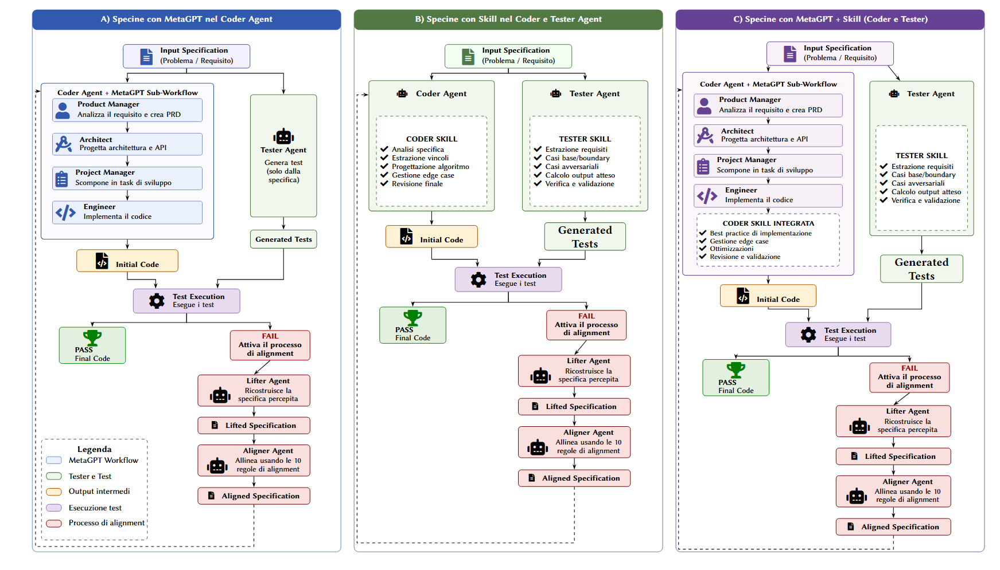

# Specine con Coder MetaGPT

## Indice

- [Obiettivo](#obiettivo)
- [Modalità di esecuzione](#modalità-di-esecuzione)
  - [Base (baseline)](#avvio-della-baseline-base)
  - [Variante A — MetaGPT nel Coder Agent](#avvio-della-variante-a)
  - [Variante B — Skill nel Coder e nel Tester Agent](#varianti-b-e-c)
  - [Variante C — MetaGPT e Skill](#varianti-b-e-c)
- [Preparazione dell'ambiente](#preparazione-dellambiente)
- [Modello predefinito](#modello-predefinito)
- [API compatibili](#api-compatibili)
- [File avviabili e flag](#file-avviabili-e-flag)
- [Benchmark disponibili](#benchmark-disponibili)
- [Download dei dataset](#download-dei-dataset)
- [Esecuzione rapida](#esecuzione-rapida)
- [Risultati](#risultati)
- [Configurazione completa del run predefinito](#configurazione-completa-del-run-predefinito)



## Obiettivo

Questo fork confronta la generazione originale di Specine con varianti che evolvono il workflow del Coder Agent e del Tester Agent.

La [modalità Base](#avvio-della-baseline-base) usa una singola chiamata al modello per generare il codice. La [variante A](#avvio-della-variante-a) usa in sequenza Product Manager, Architect, Project Manager ed Engineer. Le varianti [B e C](#varianti-b-e-c) descrivono le estensioni basate su Skill previste dall'architettura.

I benchmark disponibili sono esclusivamente APPS, APPS-Eval e CodeContests-Raw.

## Modalità di esecuzione

La **Base (baseline)** è la versione di riferimento: esegue il workflow originale di Specine, nel quale il Coder Agent genera il codice con una sola chiamata al modello. Si avvia con `--variant base`; poiché `base` è il valore predefinito, il flag può essere omesso. Vedere [Avvio della baseline](#avvio-della-baseline-base).

La **variante A** mantiene il Tester Agent e il processo di allineamento di Specine invariati, ma sostituisce la generazione diretta del Coder Agent con un sotto-workflow MetaGPT: Product Manager, Architect, Project Manager ed Engineer lavorano in sequenza prima della generazione del codice. Vedere [Avvio della variante A](#avvio-della-variante-a).

La **variante B** prevede l'uso di una Coder Skill e di una Tester Skill: il Coder Agent affronta analisi della specifica, casi limite, progettazione, gestione degli errori e revisione; il Tester Agent estrae requisiti, casi base/boundary e avversariali, quindi verifica l'output. Vedere [Varianti B e C](#varianti-b-e-c).

La **variante C** combina il sotto-workflow MetaGPT della variante A con le Skill previste dalla variante B: l'Engineer usa una Coder Skill integrata e il Tester Agent usa la Tester Skill. Vedere [Varianti B e C](#varianti-b-e-c).

I risultati della Base servono come termine di confronto per misurare l'effetto delle altre modalità. Per un confronto corretto bisogna usare lo stesso modello, lo stesso benchmark e lo stesso numero massimo di iterazioni; deve cambiare solo il workflow scelto.

## Preparazione dell'ambiente

Eseguire tutti i comandi dalla cartella principale del progetto. È richiesto Python 3.10.

### Windows PowerShell

```powershell
py -3.10 -m venv .venv
.\.venv\Scripts\Activate.ps1
python -m pip install --upgrade pip
python -m pip install -r requirements.txt
```

Se PowerShell non consente l'attivazione dell'ambiente virtuale, usare direttamente il suo interprete.

```powershell
.\.venv\Scripts\python.exe -m pip install --upgrade pip
.\.venv\Scripts\python.exe -m pip install -r requirements.txt
```

### Linux e macOS

```bash
python3.10 -m venv .venv
source .venv/bin/activate
python -m pip install --upgrade pip
python -m pip install -r requirements.txt
```

Le dipendenze installano PyTorch 2.5.1 per CUDA 12.4. Per eseguire localmente un modello da 7 miliardi di parametri è consigliata una GPU NVIDIA.

## Modello predefinito

Il modello predefinito è `deepseek-coder-7b-instruct-v1.5`. Tutti i comandi riportati sotto usano DeepSeek senza richiedere l'opzione `--model_name`.

Dopo avere installato le dipendenze e attivato l'ambiente virtuale, scaricare il modello con lo script incluso nel progetto:

```bash
python download_model.py
```

Lo script scarica l'intero repository `deepseek-ai/deepseek-coder-7b-instruct-v1.5` nella posizione attesa dal programma:

```text
LLMs/deepseek-coder-7b-instruct-v1.5/
```

La directory deve contenere configurazione, tokenizer e pesi del modello. Un download interrotto può essere ripreso eseguendo nuovamente lo stesso comando; i file già aggiornati non vengono scaricati di nuovo.

Qwen2.5-Coder-7B-Instruct può essere eseguito localmente con il nome `Qwen2.5-Coder-7B-Instruct` oppure tramite OpenRouter. Per usarlo via API, configurare `OPENROUTER_API_KEY` e impostare lo slug Qwen in `OPENROUTER_MODEL`.

```powershell
$env:OPENROUTER_API_KEY="<api-key>"
$env:OPENROUTER_MODEL="qwen/qwen2.5-coder-7b-instruct"
python alignment.py --model_name openrouter --benchmark apps --save_dir qwen_openrouter_apps
```

## API compatibili

Il progetto usa il client Python OpenAI e supporta questi provider:

| Provider | Valore `--model_name` | Variabili richieste | Endpoint predefinito |
| --- | --- | --- | --- |
| OpenAI | `gpt-4o-mini-2024-07-18` | `OPENAI_API_KEY` | Endpoint ufficiale del client OpenAI |
| Google Gemini | `gemini-1.5-flash-002` | `GEMINI_API_KEY` | `https://generativelanguage.googleapis.com/v1beta/openai/` |
| OpenRouter | `openrouter` | `OPENROUTER_API_KEY`, `OPENROUTER_MODEL` | `https://openrouter.ai/api/v1` |

Le variabili possono essere definite nel sistema oppure in un file `.env` nella directory principale. Copiare `.env.example` in `.env` e compilare solo il provider usato.

Con OpenRouter, `OPENROUTER_MODEL` accetta qualsiasi slug testuale disponibile nel [catalogo OpenRouter](https://openrouter.ai/models) e compatibile con Chat Completions. Esempio:

```env
OPENROUTER_API_KEY=sk-or-v1-...
OPENROUTER_MODEL=qwen/qwen2.5-coder-7b-instruct
OPENROUTER_APP_TITLE=Specine
```

```powershell
python alignment.py --model_name openrouter --benchmark apps --save_dir openrouter_apps
```

`OPENROUTER_HTTP_REFERER` e `OPENROUTER_APP_TITLE` sono opzionali. `OPENROUTER_BASE_URL`, `GEMINI_BASE_URL` e `OPENAI_BASE_URL` permettono di sostituire gli endpoint predefiniti. OpenRouter è compatibile con il client OpenAI usato dal progetto e restituisce `prompt_tokens` e `completion_tokens`, quindi il conteggio token resta attivo. Vedere la [documentazione OpenRouter per OpenAI SDK](https://openrouter.ai/docs/guides/community/openai-sdk).

## File avviabili e flag

Le CLI supportate sono `alignment.py` per eseguire i benchmark e `download_datasets.py` per scaricare i dataset. `eval_code.py` conserva un entry point legacy: la valutazione usata dal flusso corrente viene già eseguita internamente da `alignment.py`, quindi non è necessario avviarlo separatamente.

### alignment.py

<table>
  <thead>
    <tr>
      <th>File</th>
      <th>Flag</th>
      <th>Obbligatorio</th>
      <th>Default</th>
      <th>Valori ammessi</th>
      <th>Funzione</th>
    </tr>
  </thead>
  <tbody>
    <tr>
      <td><code>alignment.py</code></td>
      <td><code>-h</code>, <code>--help</code></td>
      <td>No</td>
      <td>Nessuno</td>
      <td>Nessuno</td>
      <td>Mostra la guida della CLI e termina.</td>
    </tr>
    <tr>
      <td><code>alignment.py</code></td>
      <td><code>--benchmark</code></td>
      <td>Sì</td>
      <td>Nessuno</td>
      <td><code>apps</code>, <code>apps-eval</code>, <code>codecontests-raw</code></td>
      <td>Seleziona il benchmark da eseguire.</td>
    </tr>
    <tr>
      <td><code>alignment.py</code></td>
      <td><code>--model_name</code></td>
      <td>No</td>
      <td><code>deepseek-coder-7b-instruct-v1.5</code></td>
      <td><code>deepseek-coder-7b-instruct-v1.5</code>, <code>Qwen2.5-Coder-7B-Instruct</code> (locale), <code>gpt-4o-mini-2024-07-18</code>, <code>gemini-1.5-flash-002</code>, <code>openrouter</code></td>
      <td>Seleziona il modello locale o il backend API.</td>
    </tr>
    <tr>
      <td><code>alignment.py</code></td>
      <td><code>--variant</code></td>
      <td>No</td>
      <td><code>base</code></td>
      <td><code>base</code>, <code>A</code>, <code>B</code>, <code>C</code></td>
      <td><code>base</code> usa Specine originale. <code>A</code> usa il Coder MetaGPT. <code>B</code> e <code>C</code> sono riservate e al momento terminano con un errore.</td>
    </tr>
    <tr>
      <td><code>alignment.py</code></td>
      <td><code>--save_dir</code></td>
      <td>Sì</td>
      <td>Nessuno</td>
      <td>Nome di directory</td>
      <td>Imposta il nome della cartella in cui salvare i risultati.</td>
    </tr>
    <tr>
      <td><code>alignment.py</code></td>
      <td><code>--max_iter</code></td>
      <td>No</td>
      <td><code>10</code></td>
      <td>Numero intero</td>
      <td>Imposta il numero massimo di iterazioni per ogni problema.</td>
    </tr>
    <tr>
      <td><code>alignment.py</code></td>
      <td><code>--debug</code></td>
      <td>No</td>
      <td>Disattivato</td>
      <td>Flag senza valore</td>
      <td>Stampa prompt e risposte del modello durante l'esecuzione.</td>
    </tr>
  </tbody>
</table>

### download_datasets.py

<table>
  <thead>
    <tr>
      <th>File</th>
      <th>Flag</th>
      <th>Obbligatorio</th>
      <th>Default</th>
      <th>Valori ammessi</th>
      <th>Funzione</th>
    </tr>
  </thead>
  <tbody>
    <tr>
      <td><code>download_datasets.py</code></td>
      <td><code>-h</code>, <code>--help</code></td>
      <td>No</td>
      <td>Nessuno</td>
      <td>Nessuno</td>
      <td>Mostra la guida della CLI e termina.</td>
    </tr>
    <tr>
      <td><code>download_datasets.py</code></td>
      <td><code>--benchmark</code></td>
      <td>No</td>
      <td>Menu interattivo</td>
      <td><code>apps</code>, <code>apps-eval</code>, <code>codecontests-raw</code></td>
      <td>Scarica il dataset associato al benchmark. Se viene omesso, mostra il menu di scelta.</td>
    </tr>
    <tr>
      <td><code>download_datasets.py</code></td>
      <td><code>--force</code></td>
      <td>No</td>
      <td>Disattivato</td>
      <td>Flag senza valore</td>
      <td>Riscarica e sostituisce il dataset anche quando il file esiste già.</td>
    </tr>
  </tbody>
</table>

### eval_code.py

Questa tabella descrive esclusivamente l'entry point legacy.

<table>
  <thead>
    <tr>
      <th>File</th>
      <th>Flag</th>
      <th>Obbligatorio</th>
      <th>Default</th>
      <th>Valori ammessi</th>
      <th>Funzione</th>
    </tr>
  </thead>
  <tbody>
    <tr>
      <td><code>eval_code.py</code> legacy</td>
      <td><code>-h</code>, <code>--help</code></td>
      <td>No</td>
      <td>Nessuno</td>
      <td>Nessuno</td>
      <td>Mostra la guida della CLI e termina.</td>
    </tr>
    <tr>
      <td><code>eval_code.py</code> legacy</td>
      <td><code>--data_name</code></td>
      <td>No</td>
      <td>Stringa vuota</td>
      <td>Qualsiasi stringa. I valori previsti dalla vecchia CLI sono <code>apps</code>, <code>code_contests</code> e <code>xCodeEval</code>.</td>
      <td>Seleziona il vecchio nome del dataset usato dalla CLI legacy.</td>
    </tr>
    <tr>
      <td><code>eval_code.py</code> legacy</td>
      <td><code>--model_name</code></td>
      <td>No</td>
      <td><code>deepseek-coder-7b-instruct-v1.5</code></td>
      <td>Nome del modello</td>
      <td>Individua la cartella dei risultati da valutare.</td>
    </tr>
    <tr>
      <td><code>eval_code.py</code> legacy</td>
      <td><code>--train</code></td>
      <td>No</td>
      <td>Disattivato</td>
      <td>Flag senza valore</td>
      <td>Seleziona la vecchia partizione di addestramento.</td>
    </tr>
    <tr>
      <td><code>eval_code.py</code> legacy</td>
      <td><code>--test</code></td>
      <td>No</td>
      <td>Disattivato</td>
      <td>Flag senza valore</td>
      <td>Seleziona la vecchia partizione di valutazione. Se non si passa né questo flag né <code>--train</code>, il programma termina senza elaborare dati.</td>
    </tr>
    <tr>
      <td><code>eval_code.py</code> legacy</td>
      <td><code>--debug</code></td>
      <td>No</td>
      <td>Disattivato</td>
      <td>Flag senza valore</td>
      <td>Abilita la diagnostica durante la valutazione.</td>
    </tr>
  </tbody>
</table>

Per vedere la guida generata direttamente da ogni entry point usare questi comandi dopo avere installato le dipendenze.

```powershell
python alignment.py --help
python download_datasets.py --help
python eval_code.py --help
```

## Benchmark disponibili

1. APPS usa l'identificatore `apps`.

2. APPS-Eval usa l'identificatore `apps-eval`.

3. CodeContests-Raw usa l'identificatore `codecontests-raw`.

APPS e APPS-Eval condividono il file `Datasets/apps.jsonl`. È quindi sufficiente scaricarlo una sola volta. CodeContests-Raw usa `Datasets/code_contests.jsonl`.

## Download dei dataset

Il downloader mostra un menu con le sole tre scelte supportate. Inserire il numero del dataset desiderato.

```powershell
python download_datasets.py
```

Per scaricare direttamente APPS usare questo comando.

```powershell
python download_datasets.py --benchmark apps
```

Per scaricare direttamente APPS-Eval usare questo comando. Se APPS è già stato scaricato, il programma riconosce che il file condiviso è presente e non lo scarica di nuovo.

```powershell
python download_datasets.py --benchmark apps-eval
```

Per scaricare direttamente CodeContests-Raw usare questo comando.

```powershell
python download_datasets.py --benchmark codecontests-raw
```

Zenodo distribuisce i dataset in un unico archivio. Il programma scarica l'archivio ufficiale, verifica dimensione e MD5, estrae soltanto il file richiesto e lo verifica tramite dimensione e CRC32. Al termine conserva nella cartella `Datasets` solo il file scelto e rimuove l'archivio temporaneo.

Un dataset valido già presente non viene sovrascritto. Per sostituire volontariamente un file esistente aggiungere `--force`.

```powershell
python download_datasets.py --benchmark apps --force
```

## Avvio della baseline (Base)

La baseline è la modalità predefinita. I comandi seguenti usano DeepSeek e un massimo di 10 iterazioni perché `--model_name`, `--variant` e `--max_iter` non vengono specificati.

### APPS

```powershell
python alignment.py --benchmark apps --save_dir baseline_apps
```

### APPS-Eval

```powershell
python alignment.py --benchmark apps-eval --save_dir baseline_apps_eval
```

### CodeContests-Raw

```powershell
python alignment.py --benchmark codecontests-raw --save_dir baseline_codecontests_raw
```

## Avvio della variante A

La variante `A` attiva il workflow MetaGPT nel Coder Agent. Anche questi comandi usano DeepSeek e un massimo di 10 iterazioni.

### APPS

```powershell
python alignment.py --variant A --benchmark apps --save_dir metagpt_apps
```

### APPS-Eval

```powershell
python alignment.py --variant A --benchmark apps-eval --save_dir metagpt_apps_eval
```

### CodeContests-Raw

```powershell
python alignment.py --variant A --benchmark codecontests-raw --save_dir metagpt_codecontests_raw
```

La variante `A` esegue quattro chiamate al modello per ogni generazione del Coder Agent. Richiede quindi più tempo della baseline. Il modello viene caricato una sola volta.

## Varianti B e C

La variante `B` è progettata per usare una Coder Skill e una Tester Skill, mentre la variante `C` combina queste Skill con il sotto-workflow MetaGPT del Coder Agent. Il diagramma all'inizio del README mostra i due flussi previsti.

Al momento queste due varianti sono riservate per l'implementazione futura: i valori `--variant B` e `--variant C` sono riconosciuti dalla CLI, ma l'esecuzione termina intenzionalmente con un errore. Per eseguire i benchmark usare quindi la [Base](#avvio-della-baseline-base) o la [variante A](#avvio-della-variante-a).

## Esecuzione rapida

Per controllare la configurazione con una sola iterazione usare questo comando.

```powershell
python alignment.py --variant A --benchmark apps --save_dir controllo --max_iter 1
```

## Risultati

I risultati vengono salvati secondo questa struttura.

```text
Results/<modello>/<benchmark>/<save_dir>/
```

Per la variante `A` il suffisso `_A` viene aggiunto automaticamente al nome indicato in `--save_dir`. Per esempio, il comando APPS della variante crea la directory seguente.

```text
Results/deepseek-coder-7b-instruct-v1.5/apps/metagpt_apps_A/
```

La console mostra Pass@1 e AvgPassRatio durante l'esecuzione. Se il processo viene interrotto, rilanciare lo stesso comando per riutilizzare gli artefatti già salvati.

Ogni chiamata al modello viene registrata nella directory del run:

- `token_usage.jsonl`: un evento per chiamata, con benchmark, problema, iterazione, fase, agente, token di input, token di output e totale;
- `token_usage_summary.json`: totale del benchmark e aggregazioni per agente, iterazione e fase.

> [!note] Nota
> **Come vengono contati i token.** Per i modelli locali, input e output sono calcolati direttamente dagli ID del tokenizer. Per le API vengono letti i valori `usage` restituiti dal provider. Se `usage` non è disponibile, il conteggio viene stimato e l'evento riporta `estimated: true` insieme al metodo usato.
>
> **Effetto della cache.** Quando un risultato già salvato evita una nuova chiamata al modello, non vengono consumati token e non viene creato alcun nuovo evento. Se si riprende lo stesso run, il riepilogo conserva i token delle chiamate eseguite in precedenza, mentre ogni risultato recuperato dalla cache aggiunge zero token.

## Configurazione completa del run predefinito

Il comando seguente rappresenta un run predefinito su APPS. `--benchmark` e `--save_dir` sono obbligatori e quindi non possiedono un valore predefinito; tutti gli altri flag vengono omessi.

```bash
python alignment.py --benchmark apps --save_dir baseline_apps
```

| Categoria | Impostazione | Valore predefinito | Note |
| --- | --- | --- | --- |
| CLI | Benchmark | Nessuno | Obbligatorio; nell'esempio è `apps`. Valori: `apps`, `apps-eval`, `codecontests-raw`. |
| CLI | Directory risultati | Nessuna | Obbligatoria tramite `--save_dir`; nell'esempio è `baseline_apps`. |
| CLI | Modello | `deepseek-coder-7b-instruct-v1.5` | Caricato dalla directory `LLMs/deepseek-coder-7b-instruct-v1.5/`. |
| CLI | Variante | `base` | Usa il Coder Agent originale con una sola chiamata per ogni generazione di codice. |
| CLI | Iterazioni massime | `10` | Corrisponde a `--max_iter 10`. |
| CLI | Debug | Disattivato | Si abilita aggiungendo `--debug`. |
| Generazione | Token massimi del codice | `1024` | Valore dichiarato nel paper e usato dal Coder Agent. |
| Generazione | Temperatura | `0.8` | Valore dichiarato nel paper. |
| Generazione | Sampling | Attivato | `do_sample=True`, necessario affinché la temperatura venga applicata da Transformers. |
| Generazione | Seed casuale | Non impostato | Due run possono produrre output differenti a causa del sampling. |
| Generazione | Batch | `1` prompt | Il tokenizer riceve un solo prompt per chiamata. |
| Generazione | Padding token | Token EOS del tokenizer | `pad_token_id=tokenizer.eos_token_id`. |
| Generazione | Fine sequenza | Token EOS del tokenizer | `eos_token_id=tokenizer.eos_token_id`. |
| Caricamento | Precisione dei pesi | Automatica | `torch_dtype="auto"` conserva la precisione indicata dal checkpoint. |
| Caricamento | Posizionamento | Automatico | `device_map="auto"` distribuisce il modello sulle risorse disponibili. |
| Fasi Specine | Lifting della specifica | Massimo `512` token | Limite specifico della fase interna. |
| Fasi Specine | Selezione del disallineamento | Massimo `64` token | Limite specifico della fase interna. |
| Fasi Specine | Regola di allineamento | Massimo `256` token | Limite specifico della fase interna. |
| Fasi Specine | Generazione test aggiuntivi | Massimo `1024` token | Usata quando servono test generati dal modello. |
| Output | Percorso risultati | `Results/<modello>/<benchmark>/<save_dir>/` | Per la variante `A`, al nome viene aggiunto automaticamente il suffisso `_A`. |
| Output | Consumo token | Registrazione automatica | Salva ogni chiamata LLM e aggrega input/output per agente, iterazione e fase. |

I valori `max tokens = 1024`, `temperature = 0.8` e `N = 10` seguono la sezione 4.4 del [paper di Specine](https://arxiv.org/pdf/2509.01313). La variante `A` mantiene la stessa configurazione di generazione, ma usa quattro ruoli e limita a 512 token gli output intermedi di Product Manager, Architect e Project Manager; l'Engineer conserva il limite di 1024 token.
