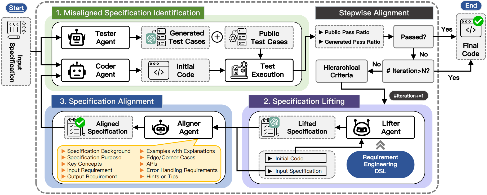
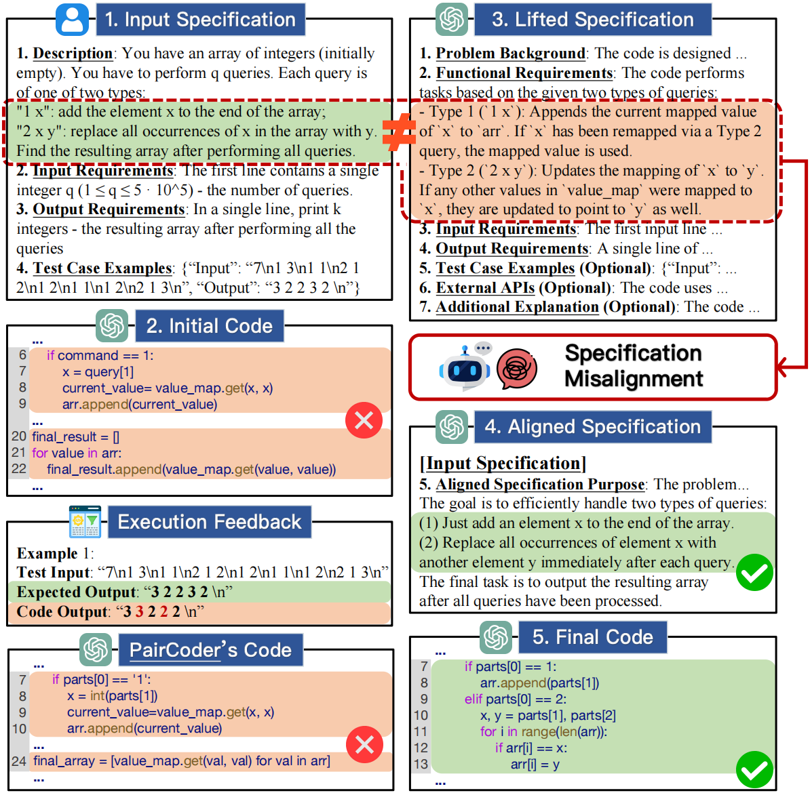
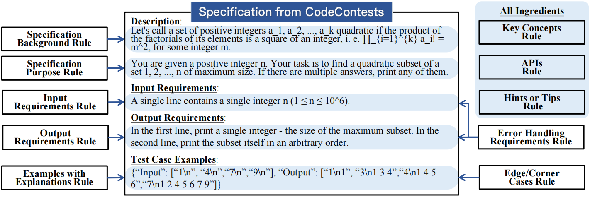
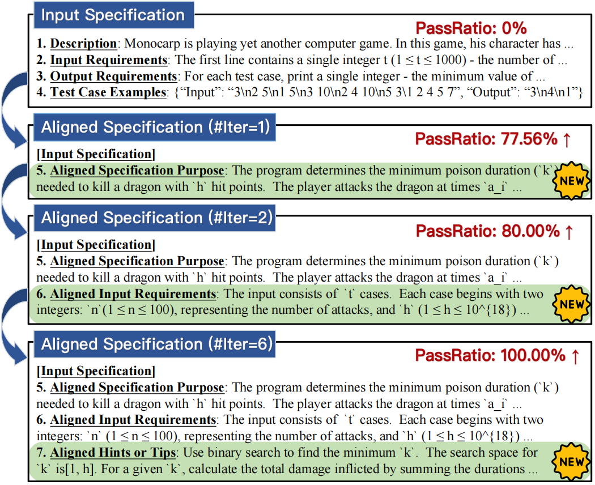
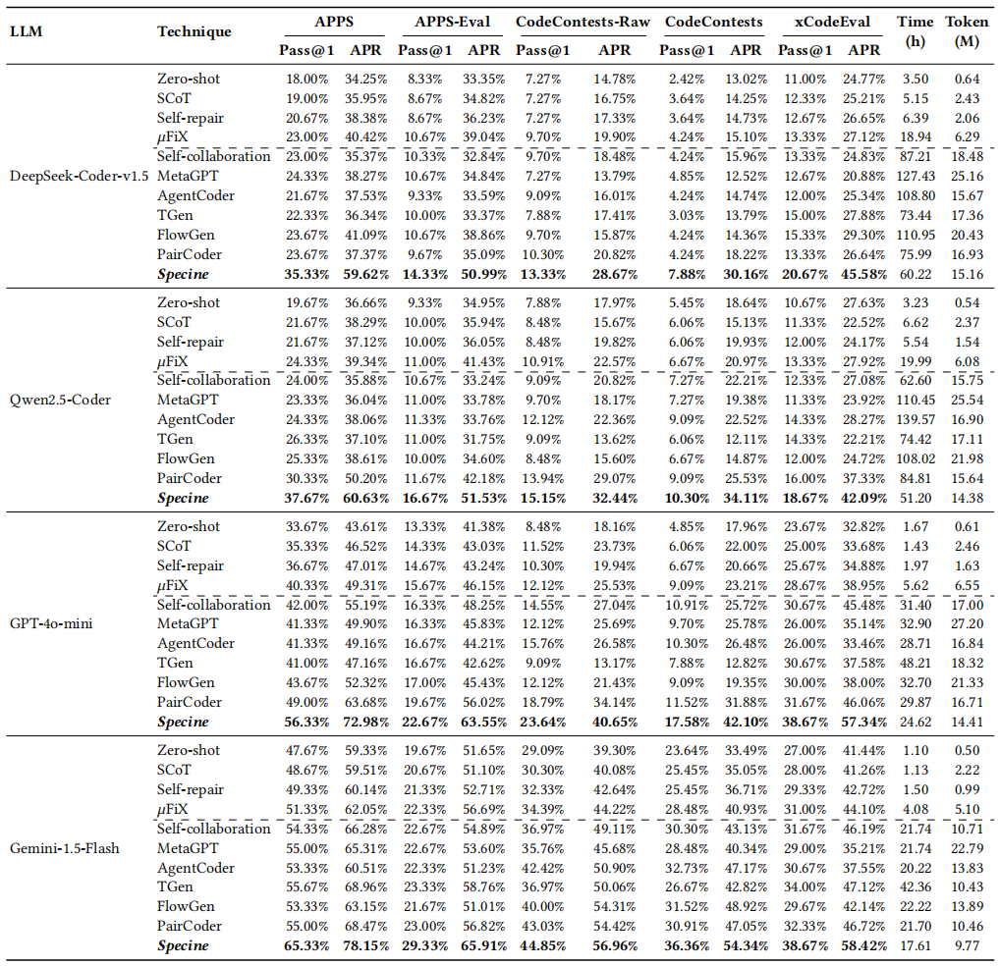
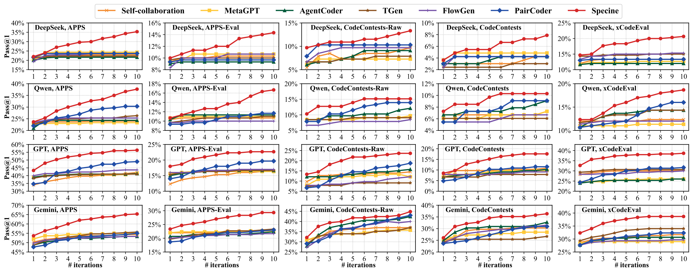
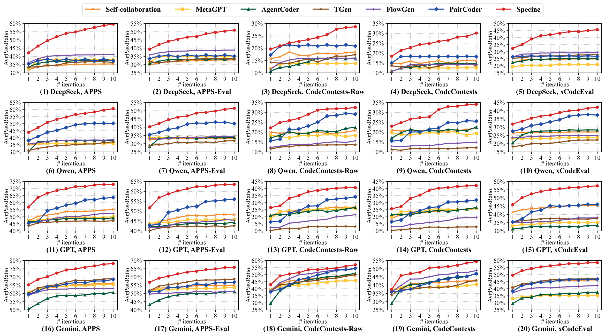
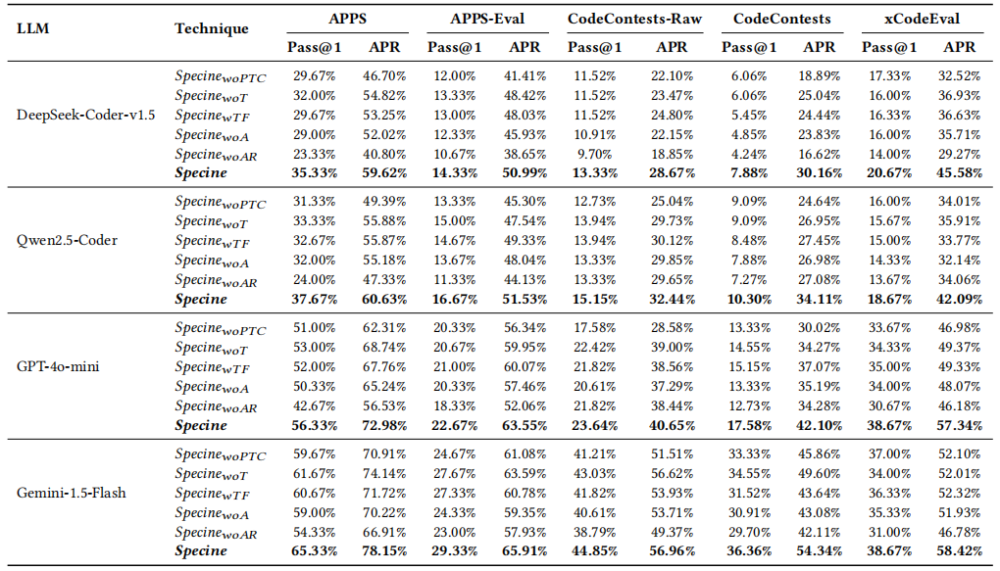
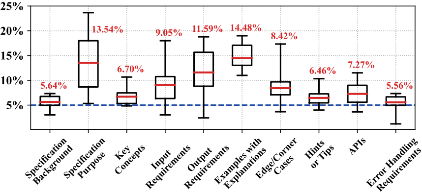

# Homepage of Specine
--- ---
- [Overview](#overview)
- [Folder Structure](#folder-structure)
- [Environment Configuration](#environment-configuration)
- [Datasets](#datasets)
- [LLMs](#llms)
- [Run Experiments](#run-experiments)
- [Illustrative Examples](#illustrative-examples)
- [Experimental Results](#experimental-results)

--- --- ---

## Overview


--- --- ---

## Folder Structure
```text
.
├── Dataset
│   ├── apps.jsonl
│   ├── code_contests.jsonl
│   ├── README.md
│   └── xCodeEval.jsonl
├── Figures
├── alignment.py
├── data.py
├── eval_code.py
├── LICENSE.txt
├── model.py
├── README.md
├── requirements.txt
├── sanitize.py
└── testing_util.py
```

--- --- ---

## Environment Configuration
Make sure to use python 3.10 or later:
```text
conda create -n alignment python=3.10;
conda activate alignment;
```
Detailed configurations can be found in ```Specine/requirements.txt```.
```text
pip install -r requirements.txt;
```

--- --- ---

## Datasets

To comprehensively evaluate Specine, we utilized five challenging benchmarks in our study: APPS, APPS-Eval, CodeContests-Raw, CodeContests, and xCodeEval. 
These datasets are commonly used in many existing LLM-based code generation studies.
All processed datasets can be downloaded from our anonymous [Zenodo Link](https://zenodo.org/records/15033911).

Note that our studied datasets are all public datasets, and they can also be found in the following related work:
- [APPS](https://github.com/hendrycks/apps)
- [APPS-Eval](https://github.com/YihongDong/CodeGenEvaluation)
- [CodeContests-Raw](https://github.com/deepmind/code_contests)
- [CodeContests](https://github.com/deepmind/code_contests)
- [xCodeEval](https://github.com/ntunlp/xCodeEval)

--- --- ---

## LLMs

To evaluate the performance of Specine, we selected a variety of open-source and commercial LLMs for our study. 
For open-source LLMs, we chose two representative LLMs: DeepSeek-Coder-7B-Instruct-V1.5 and Qwen2.5-Coder-7B-Instruct. 
Specifically, we downloaded them via the Huggingface platform and deployed them in a local environment for our experiments.

For commercial LLMs, we selected two widely-used and advanced LLMs: GPT-4o-mini and Gemini-1.5-Flash. 
We accessed these commercial LLMs through the respective APIs provided by OpenAI and Google AI.

--- --- ---

## Run Experiments

### Demo
We use gemini-1.5-flash-002 as the representative LLM on the CodeContests benchmark. 

```text
cd Specine/;

# gemini-1.5-flash-002, code_contests
CUDA_VISIBLE_DEVICES=0 python alignment.py \
    --save_dir=test_alignment \
    --data_name=code_contests \
    --model_name=gemini-1.5-flash-002 2>&1| tee test_alignment_gemini_code_contests.log;
```
The generated results are saved in the ```Specine/Results/gemini-1.5-flash-002/test_alignment/``` folder directory.

--- --- ---

## Illustrative Examples

#### 1) An example from Codeforces with GPT-4o-mini.


--- ---

#### 2) Correspondence between alignment rules and key specification ingredients.


--- ---

#### 3) Case study on CodeContests with Gemini-1.5.



--- --- ---

## Experimental Results
--- ---
#### 1) Effectiveness and efficiency comparison in terms of Pass@1 (↑), AvgPassRatio (↑), Time Overhead (↓), and Token Overhead (↓). APR is short for AvgPassRatio.


--- ---

#### 2) Influence of the number of iterations (𝑁) in terms of Pass@1 (↑).


--- ---

#### 3) Influence of the number of iterations (𝑁) in terms of AvgPassRatio (↑).


--- ---

#### 4) Comparison between Specine and its variants in terms of Pass@1 (↑) and AvgPassRatio (↑). APR is short for AvgPassRatio.


--- ---

#### 5) Effectiveness of each alignment rule in Specine.


--- ---
